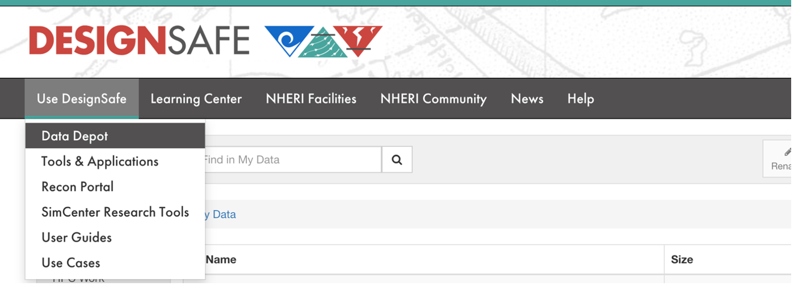
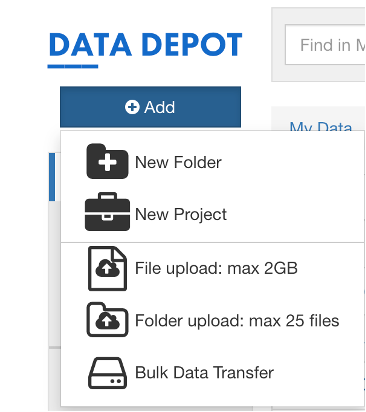
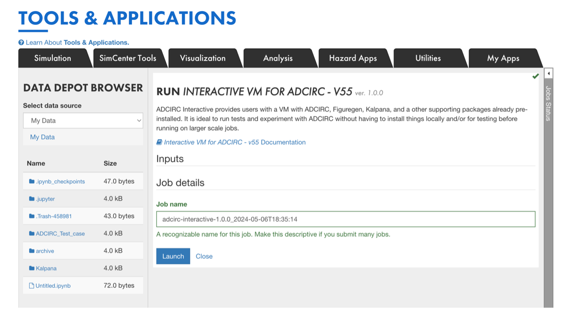
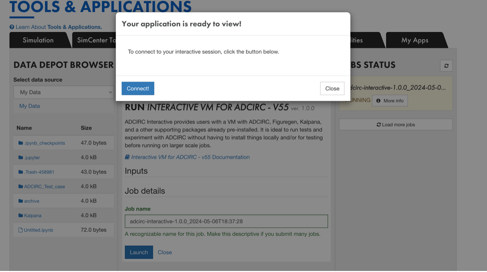
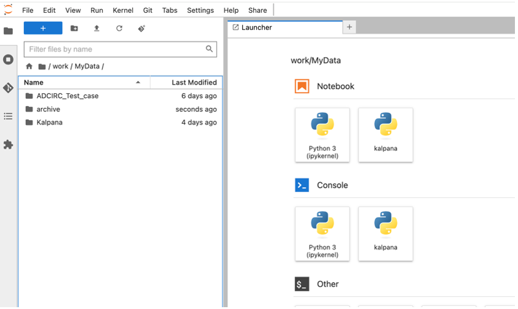
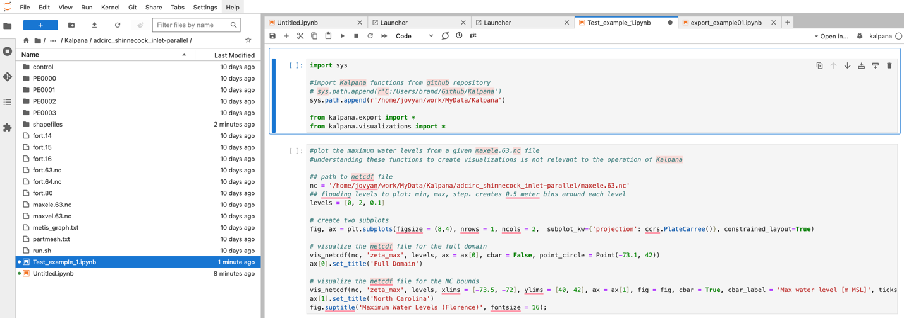
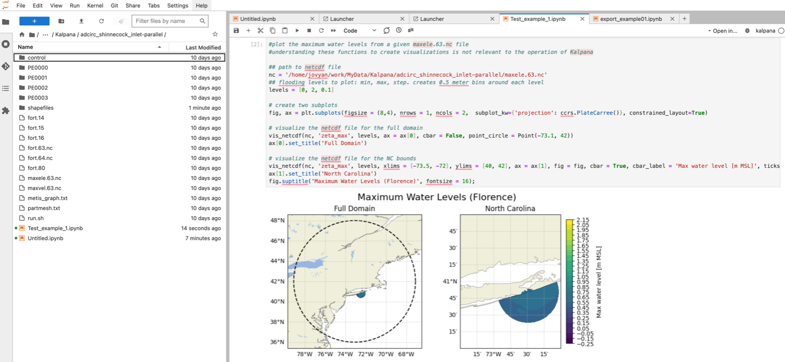

## Visualization of ADCIRC Results using Kalpana

**Kalpana Use Case - Using Kalpana Interative Virtual Machine (VM) to Visualize ADCIRC Results on DesignSafe**   

### Overview
This guide helps you use the Kalpana packages with Jupyter Notebook on DesignSafe. Kalpana is a tool that converts ADCIRC output files into GIS-compatible shapefiles. You can learn more about Kalpana here: <a href="https://ccht.ccee.ncsu.edu/how-to-run-kalpana/" target="_blank">https://ccht.ccee.ncsu.edu/how-to-run-kalpana/</a>.

### Getting Started
There are two ways to run Kalpana on DesignSafe:

[Submitting a Kalpana Job in the Workspace ](https://www.designsafe-ci.org/user-guide/tools/visualization/#kalpana-user-guide)

**Using Interactive Virtual Machine (VM) for Kalpana:** This guide focuses on this method.

### Before You Begin

Make sure your ADCIRC output files are stored on DesignSafe. You can upload or transfer files using the Recommended Data Transfer Methods found [here](https://www.designsafe-ci.org/user-guide/managingdata/datatransfer/). Also, you can submit a job to run ADCIRC directly on DewsignSafe.

### Launching the Interactive VM 

1.	Upload your data to DesignSafe. You’ll find your files in ‘work/MyData/’.
2.	Once your data is uploaded, launch the interactive VM. You can find an option to launch the VM app under "Simulation" -> ADCIRC

3.	When your application is ready to review, you are able to connect the VM. 

### Runing Kalpana
1.	When you connect to the VM, there is an option for Kalpana under the notebook. This virtual environment has the required packages for Kalpana preinstalled. 

2.	Kalpana can be run as shown in examples on its GitHub, more examples can be found here: <a href="https://github.com/ccht-ncsu/Kalpana/tree/master/examples " target="_blank">https://github.com/ccht-ncsu/Kalpana/tree/master/examples </a>.

